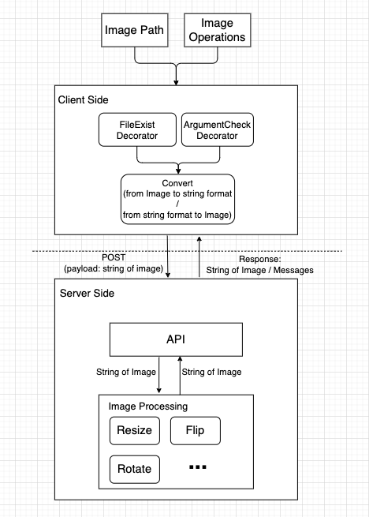

## Image Process

This project is used to help users to do some simple process work, including rotating, fliping, resizing, graying and generating thumbnail images. Users can apply one / many actions to the image at one time. At the end, the new image will be saved in local disk where the client is running.

`To applying multiple actions, these actions will be applied in order and you just need specify the location only once. if provided the location for more than 2 times, it will fail. Please see the below examples.`

### Prepare
1. an image in the local disk
2. the operations you want to apply to the image
2. a python3 environment to run the client: `pip3 install -r /path/to/requirements.txt`
### How to use
1. Apply only one action to the image
```
// resize the imageExample.jpg to the new size with width 100 and height 200
python3 client.py resize -f /path/to/imageExample.jpg -w 100 -h 200

// flip the imageExample.jpg vertically
python3 client.py flip -d v -f /path/to/imageExample.jpg

More info: python3 client3.py -h
```
2. Apply multiple actions to the image
```
// resize the image twice but lastly the size is 50*20
python3 client.py resize -f /path/to/imageExample.jpg -w 100 -h 200 resize -w 50 -h 20

// resize -> flip -> rotate -> gray -> thumb
// specify the image location only one time
python3 client.py resize -f /path/to/image.jpg -w 100 -hi 200 flip -d v rotate -a 100 gray thumb
```

## Architecture

[Software Arch](https://drive.google.com/file/d/1MMYJ4xT0gDfB25MNG_GbHQfWYqefYjo-/view?usp=sharing)

### snapshot



## APIs
[API documents by Swagger](https://xxx0624.github.io/ImageProcess/)
